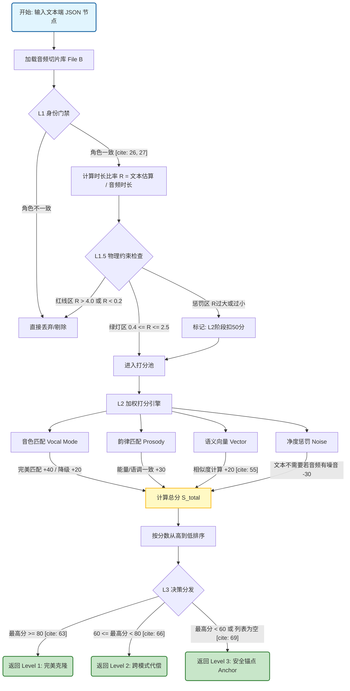

```mermaid
graph TD
    %% 定义样式
    classDef input fill:#e1f5fe,stroke:#01579b,stroke-width:2px;
    classDef process fill:#fff9c4,stroke:#fbc02d,stroke-width:2px;
    classDef decision fill:#fce4ec,stroke:#880e4f,stroke-width:2px;
    classDef filter fill:#ffccbc,stroke:#bf360c,stroke-width:2px;
    classDef result fill:#c8e6c9,stroke:#2e7d32,stroke-width:2px;

    start(开始: 输入文本端 JSON 节点):::input --> A[加载音频切片库 File B];
    A --> L1{L1 身份门禁};

    %% L1 阶段
    L1 -- 角色不一致 --> B[直接丢弃/剔除];
    L1 -- 角色一致 [cite: 26, 27] --> L1_5_Calc[计算时长比率 R = 文本估算 / 音频时长];

    %% L1.5 阶段
    L1_5_Calc --> L1_5{L1.5 物理约束检查};
    L1_5 -- 红线区 R > 4.0 或 R < 0.2  --> B;
    L1_5 -- 绿灯区 0.4 <= R <= 2.5 --> L2_Prep[进入打分池];
    L1_5 -- 惩罚区 R过大或过小  --> L2_Penalty[标记: L2阶段扣50分];
    L2_Penalty --> L2_Prep;

    %% L2 阶段
    L2_Prep --> L2_Score[L2 加权打分引擎];
    L2_Score --> S1[音色匹配 Vocal Mode];
    S1 -- 完美匹配 +40 / 降级 +20  --> S_Total;
    L2_Score --> S2[韵律匹配 Prosody];
    S2 -- 能量/语调一致 +30  --> S_Total;
    L2_Score --> S3[语义向量 Vector];
    S3 -- 相似度计算 +20 [cite: 55] --> S_Total;
    L2_Score --> S4[净度惩罚 Noise];
    S4 -- 文本不需要若音频有噪音 -30  --> S_Total;

    S_Total[计算总分 S_total]:::process --> Sort[按分数从高到低排序];

    %% L3 阶段
    Sort --> L3{L3 决策分发};
    L3 -- 最高分 >= 80 [cite: 63] --> Res1(返回 Level 1: 完美克隆):::result;
    L3 -- 60 <= 最高分 < 80 [cite: 66] --> Res2(返回 Level 2: 跨模式代偿):::result;
    L3 -- 最高分 < 60 或 列表为空 [cite: 69] --> Res3(返回 Level 3: 安全锚点 Anchor):::result;
```
